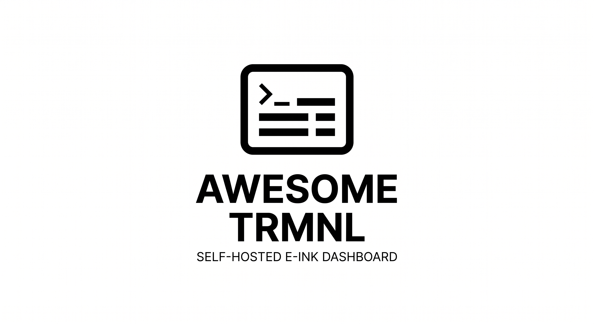

# Awesome TRMNL



A self-hosted content server for e-ink displays, heavily inspired by [TRMNL](https://usetrmnl.com). Run your own dashboard backend and pair it with custom firmware — no cloud required.

## What is this?

**Awesome TRMNL** is a standalone server that renders HTML pages into e-ink friendly images (PNG/QOI) and serves them to Wi-Fi connected e-ink displays. It was inspired by the delightful [TRMNL](https://usetrmnl.com) device, but is **not** a drop-in replacement for the official cloud service. Instead, it is designed to work with its own companion firmware for the ESP32-C6.

- **Privacy** — your data stays on your network
- **Flexibility** — mix and match plugins, or render any URL
- **Hackability** — written in Rust, easy to extend with WASM plugins

> 💡 **Companion Firmware:** Pair this server with the [ESP32-C6 firmware](https://github.com/killerfoxi/esp32_trmnl_firmware) to build your own TRMNL-like device from scratch.

## Architecture

The project is split into two crates:

| Crate | Purpose |
|-------|---------|
| `blender` | Headless Chromium renderer. Takes a URL, renders the page at 800×480, and outputs a PNG or QOI image optimized for e-ink. |
| `server` | Axum web server that hosts plugins, serves the TRMNL API, and drives the blender. |

## Features

- 📟 **Device API** — devices poll `/api/display` for their next screen image and refresh interval
- 🌤️ **Weather plugin** — current conditions and forecast via [Open-Meteo](https://open-meteo.com) (with automatic geocoding via OpenStreetMap)
- ✅ **TickTick plugin** — display tasks from a TickTick project
- 🧩 **WASM plugins** — drop in any `.wasm` file and configure it in TOML; plugins can fetch external data and return HTML
- 🧪 **Test screen** — built-in demo layout for quick verification
- 🎛️ **Mashups** — compose screens as single, left/right split, or external URL passthrough
- 🖼️ **Web preview** — view any device screen in a browser at `/preview/{id}`
- 🔒 **TLS support** — serve over HTTPS with your own certificates
- ⚡ **Fast rendering** — reuses a single Chromium instance with isolated contexts per request

## Quick Start

### Prerequisites

- [Rust](https://rustup.rs/) (stable channel)
- A Chromium-based browser (Chrome, Edge, Chromium) — used for headless rendering

### Build

```bash
cargo build --release
```

The server binary is `target/release/atrmnl_server`.

### Configure

Create a `devices.toml` file. Each top-level key is a device ID (what your TRMNL device sends as its access token):

```toml
[living-room]
mashup = { single = "weather" }

[[living-room.plugins]]
weather = { location = "Berlin", detail = "full" }

[desk]
mashup = { left_right = { left = "weather", right = "ticktick" } }

[[desk.plugins]]
weather = { location = "London", detail = "minimal" }

[[desk.plugins]]
ticktick = { project_id = "your-project-id", auth = { token = "your-ticktick-token" } }
```

Supported `mashup` variants:
- `none = "https://example.com"` — proxy an external URL directly
- `single = "plugin-name"` — one plugin fills the screen
- `left_right = { left = "plugin-name", right = "plugin-name" }` — split layout

### Run

```bash
# HTTP only (good for local testing)
atrmnl_server --nouse_tls

# HTTPS with TLS certificates
atrmnl_server -p 8223 \
  --cert_file /path/to/cert.pem \
  --key_file /path/to/private-key.pem \
  -d /path/to/devices.toml
```

Point your [ESP32-C6 firmware](https://github.com/killerfoxi/esp32_trmnl_firmware) device to `http(s)://<your-server>:8223` and you're set.

## Endpoints

| Path | Description |
|------|-------------|
| `/` | Welcome page |
| `/api/display` | TRMNL device polling endpoint (returns image URL + refresh rate) |
| `/screen/{id}` | Rendered e-ink image for device `{id}` (PNG by default, QOI if requested) |
| `/content/{id}` | Raw HTML content for device `{id}` |
| `/preview/{id}` | Browser preview of the device screen |
| `/assets/*` | Static assets (CSS, etc.) |

## WASM Plugins

You can extend the server with plugins compiled to WebAssembly. Drop a `.wasm` file anywhere accessible and reference it in `devices.toml`:

```toml
[my-device]
mashup = { single = "mydata" }

[[my-device.plugins]]
wasm = { name = "mydata", path = "plugins/mydata.wasm", config = { api_key = "xxx", city = "Zurich" } }
```

The `name` field is the key used to reference the plugin in `mashup`. The `config` table is arbitrary — it is passed as a JSON object to the plugin's `generate` function.

### Writing a WASM plugin

Plugins must export a `generate` function that receives config as a JSON string and returns HTML. Using the [Extism](https://extism.org) Rust PDK:

```toml
# Cargo.toml
[dependencies]
extism-pdk = "1"
serde = { version = "1", features = ["derive"] }
serde_json = "1"
```

```rust
use extism_pdk::*;
use serde::Deserialize;

#[derive(Deserialize)]
struct Config {
    api_key: String,
    city: String,
}

#[plugin_fn]
pub fn generate(input: String) -> FnResult<String> {
    let cfg: Config = serde_json::from_str(&input)?;

    // fetch data from an external API
    let resp = http::request(
        &HttpRequest::new(format!("https://api.example.com/data?city={}", cfg.city))
            .with_header("Authorization", format!("Bearer {}", cfg.api_key)),
        None::<String>,
    )?;

    Ok(format!("<html><body>{}</body></html>", resp.body()))
}
```

Build it with [cargo-component](https://github.com/bytecodealliance/cargo-component) or the standard Extism toolchain targeting `wasm32-wasip1`.

Plugins can fetch external data via the Extism HTTP host function (`extism_pdk::http::request`). All hosts are permitted by default.

## Installing as a Systemd Service

A sample service file is provided at `crates/server/tools/atrmnl_server.service`:

```ini
[Unit]
Description="Awesome TRMNL Server"

[Service]
Type=exec
WorkingDirectory=~
ExecStart=%h/.cargo/bin/atrmnl_server -p 8223 -d %h/.config/atrmnl_server/devices.toml --cert_file %h/.config/atrmnl_server/ssl/cert.pem --key_file %h/.config/atrmnl_server/ssl/private-key.pem
Restart=on-failure

[Install]
WantedBy=default.target
```

Copy it to `~/.config/systemd/user/` and enable with:

```bash
systemctl --user daemon-reload
systemctl --user enable --now atrmnl_server
```

## Development

This project uses [devenv](https://devenv.sh/) for a reproducible development shell:

```bash
direnv allow  # or: devenv shell
cargo run --bin atrmnl_server -- --nouse_tls
```

Build the release binary via devenv:

```bash
devenv tasks run atrmnl:build
```

The finished binary will be at `target/release/atrmnl_server`.

For Alpine Linux (musl/static linking):

```bash
devenv tasks run atrmnl:build:alpine
```

The static binary will be at `target/x86_64-unknown-linux-musl/release/atrmnl_server`.

The server will start on `http://localhost:8223`. Visit `/preview/test` to see the test screen.

## Companion Firmware

This server is designed to work with the **[ESP32-C6 e-ink firmware](https://github.com/killerfoxi/esp32_trmnl_firmware)**. The firmware handles Wi-Fi, deep sleep, and display refresh — this server handles rendering the actual content.

Together they make a fully open, self-hosted alternative to cloud-tethered e-ink displays.

## Why "Awesome"?

Because [awesome](https://github.com/sindresorhus/awesome) things are self-hosted, hackable, and put you in control. Also it sounds cool.

## License

This project is licensed under the [MIT License](LICENSE).
